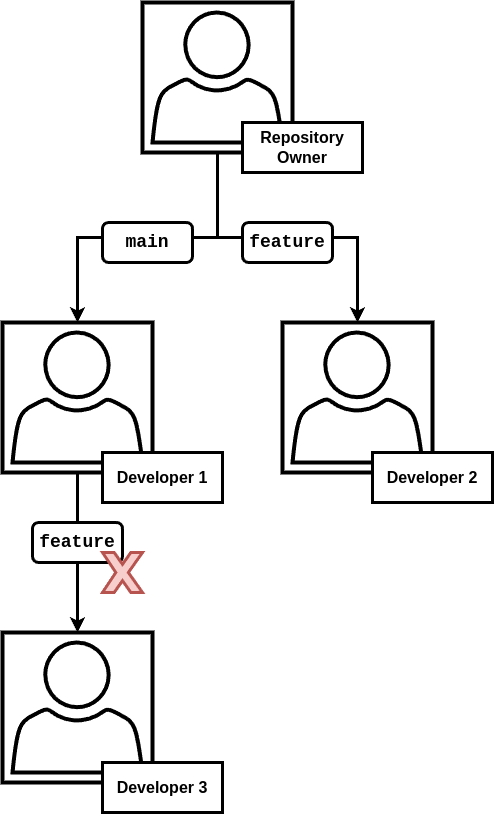

# Artifact Evaluation for gittuf - NDSS 2025

This repository contains the scripts and documentation needed to evaluate gittuf
as presented in the paper "Rethinking Trust in Forge-Based Git Security".

The evaluation can be setup by using the provided Dockerfile or manually
installing each component.

## Option A - Using the Dockerfile

This repository includes a Dockerfile that will configure a container with the
experiments.

**To clone this repository, run:**

```sh
git clone https://github.com/adityasaky/gittuf-ndss-eval
cd gittuf-ndss-eval
```

**To build and run the container, run:**

```sh
docker build -t gittuf-ndss-eval .
docker run -it gittuf-ndss-eval
```

Once completed, proceed to "Running Evaluations" below to run the experiment
scripts in the container.

## Option B - Manual Installation

Before building and evaluating gittuf, you will need to install a few packages:

- A recent version of Python 3
- [Git, 2.43 or greater](https://git-scm.com/downloads)
- GNU `make`
- [The Go toolchain, 1.22 or greater](https://go.dev/doc/install)

Installation of these tools varies with the operating system used.

A reboot or shell reload is recommended after installing the prerequisites, as
updates to your PATH need to take effect before building gittuf will succeed.

### Building gittuf

#### Install Latest Version Using Go

Once Go 1.22 or higher is installed and your PATH is configured to include
$GOBIN, you can install gittuf using `go install`.

**Run:**

```sh
go install github.com/gittuf/gittuf@latest
```

This will fetch the latest release of gittuf and place the binary in your
$GOBIN. It is important to ensure that this binary is in your PATH for the
experiments!

#### Build from Source

Alternatively, you can build from gittuf from source. First, download the source
code for gittuf, available [here](https://github.com/gittuf/gittuf). Use the
`main` branch or the latest tagged release. Cloning using Git is preferred, but
downloading the ZIP archive will work as well.

**To clone, run:**

```sh
git clone https://github.com/gittuf/gittuf
```

Open a terminal inside the downloaded repository directory and run the `make`
command. Build tests may take some time depending on your hardware and operating
system, but are important for ensuring the proper functioning of gittuf on your
platform.

**To build gittuf, run:**

```sh
cd gittuf
make just-install
```

## Running Evaluations

Clone this repository to get the experiment scripts.

**Run:**

```sh
git clone https://github.com/adityasaky/gittuf-ndss-eval
```

If you chose the manual installation process, ensure that Python 3 is installed.
This README assumes that it's available as `python3` in your PATH, though this
may vary based on your operating system. Also install the evaluation script
dependencies via the provided `requirements.txt` file. This can be using `pip`
in a virtual environment or your system package manager.

Each experiment is contained in its respective Python file. To run an
experiment, simply pass it to Python, e.g. `python3 experiment1.py`. The script
will then walk you through the steps in the experiment. Simply press the `Enter`
key to advance to the next step.

Each command is checked for the proper return code. In the case of an error, the
script will print out the issue and abort.

Note that the Python scripts should not be moved from where they are in this
evaluation repository, as they depend on accessing the keys contained in the
`keys` folder. You can however select a custom location for where the script
should write the repository used for the experiment.

### Customization

Each script file supports these options:

- `--automatic [False | True]`: Runs the demo without waiting on input to
  proceed to the next
  step.

- `--repository-directory <directory>`: Set a custom directory for the working
  repository. Unlike the standard functionality with a temporary directory, the
  directory specified here is not automatically deleted by the script after it
  exits.

## Experiment Details

### Experiment 1 - Unilateral Policy Modification

This experiment simulates a scenario where a single developer is prevented from
editing a policy that was configured to require two developers to sign off.

First, a repository owner (with key `root`) creates a gittuf-enabled repository
and delegates trust in the policy to two developers (with keys `developer1` and
`developer2`, respectively). To prevent a single developer from making changes
themselves, the threshold for policy metadata signatures is set to two. That is,
both developers need to authorize changes to the policy by signing the rule
file.

Developer 1 and 2 initialize and set a rule to protect the main branch in the
policy, with both developers signing off on the change.

Developer 1 then attempts to add another rule without developer 2's agreement,
which causes verification to fail.

**To run the experiment, run:**

```sh
python3 experiment1.py
```

### Experiment 2 - Delegations

This experiment simulates utilization of gittuf's granular delegations feature
that allows for distributing policy declaration responsibilities amongst
multiple developers without overprivileging them.

First, a repository owner defines a policy and delegates authority to make
changes to the `main` branch to developer 1 and the `feature` branch to
developer 2. Developer 1 then delegates trust to developer 3 for the `feature`
branch, _despite developer 1 not being trusted for that branch_.

When developer 3 attempts to verify their change to the `feature` branch, gittuf
alerts them that they are not trusted for the branch. In summary, this
highlights that gittuf's delegations can be used to enable developers to extend
the policy in limited ways: developer 1 is trusted to delegate trust only in the
`main` branch.

The following diagram illustrates the trust hierarchy:



**To run the experiment, run:**

```sh
python3 experiment2.py
```

### Experiment 3 - RSL Divergence

This experiment simulates a scenario focusing on how gittuf's Reference State
Log (RSL) propagates across repository copies.

First, a repository owner creates a gittuf-enabled repository and makes a
commit. User A then clones the repository and makes a change (authorized by the
policy), and then pushes their changes. The upstream repository maliciously
drops these changes.

User B then clones the repository, unaware as to what has happened. The user
makes a commit and pushes it to the remote repository. User A then attempts to
pull the latest changes, but is warned that their RSL has diverged from what
is on the remote repository, alerting them of the server's misbehavior.

**To run the experiment, run:**

```sh
python3 experiment3.py
```

### Experiment 4 - Policy Violation and Independent Verification

This experiment simulates a scenario where a user writes to a part of a
repository they are not allowed to; another user then pulls the latest copy of
the repository and then attempts to verify the changes.

A repository owner creates a gittuf-enabled repository and sets policy
authorizing a user (with key `developer1`) to make changes to the main branch.
Another user (with key `developer2`), who is only allowed to edit the `feature`
branch, submits a commit that affects the `main` branch.

Another developer then clones the repository onto their machine and attempts to
verify the changes, but gittuf raises an alert that an unauthorized signature is
on a commit (against the policy).

Developer 2 then reverts the unauthorized commit and revokes the RSL entry for
the commit, successfully restoring the repository. Note that even though
developer 2 is only authorized to make changes to the `main` branch, they were
still able to _fix_ the violation. This is because any user who is allowed to
write to the repository at all is allowed to fix it to bring it back into
compliance with policy. 

**To run the experiment, run:**

```sh
python3 experiment4.py
```
